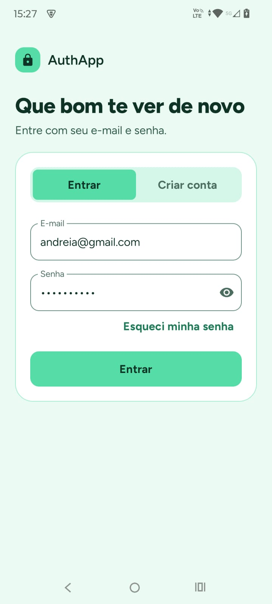
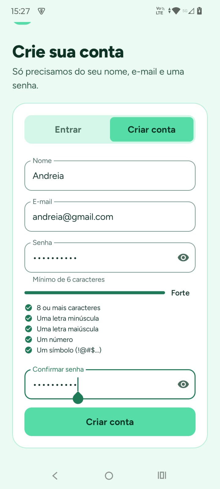
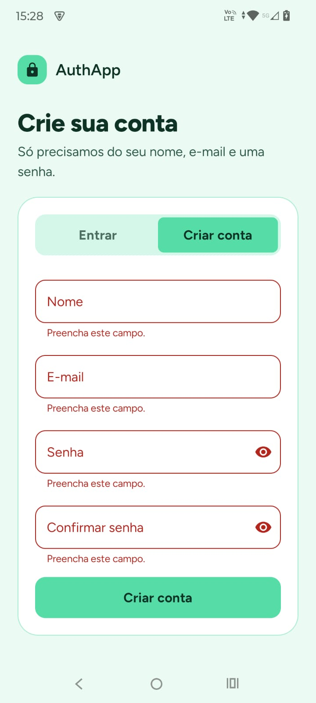
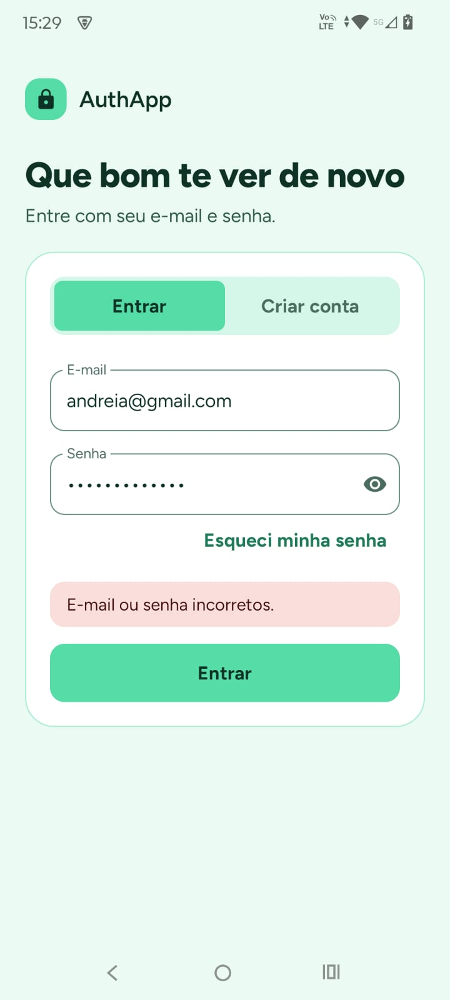
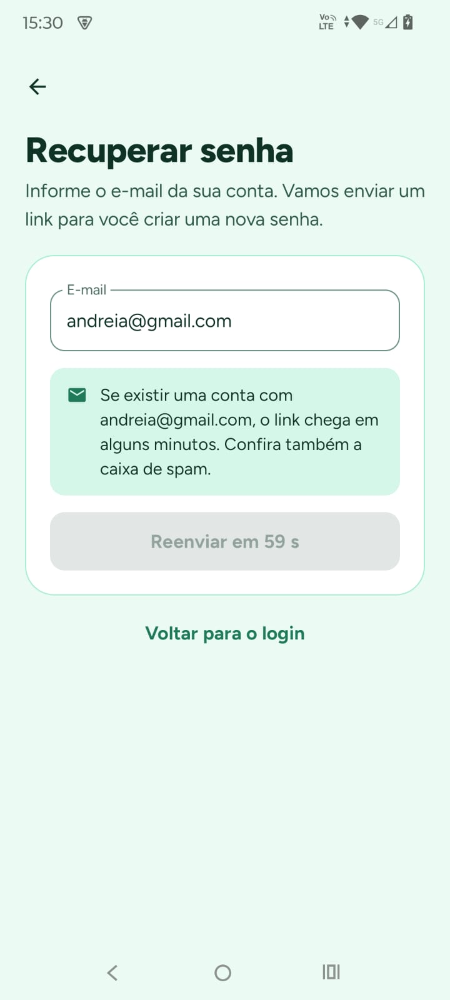
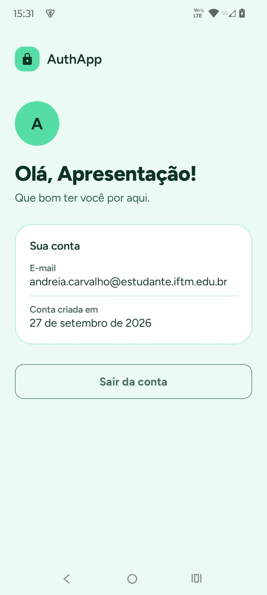
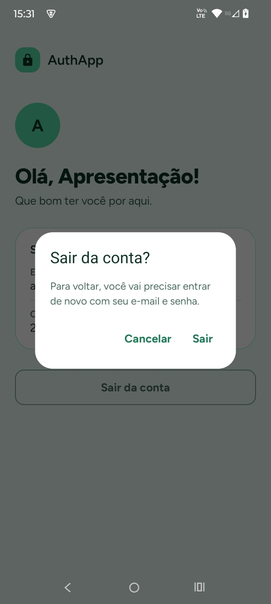

# AuthApp

Aplicativo Android de autenticação por e-mail e senha, desenvolvido com **Kotlin**, **Jetpack Compose (Material 3)** e **Firebase Authentication**. Inclui cadastro, login, recuperação de senha, medidor de força da senha em tempo real e um Dashboard com mensagem de boas-vindas personalizada e logout.


---

## Sumário

- [Screenshots](#screenshots)
- [Funcionalidades](#funcionalidades)
- [Tecnologias](#tecnologias)
- [Arquitetura](#arquitetura)
- [Pré-requisitos](#pré-requisitos)
- [Configuração do Firebase](#configuração-do-firebase)
- [Compilação e execução](#compilação-e-execução)
- [Testes](#testes)
- [Tratamento de erros](#tratamento-de-erros)
- [Design e acessibilidade](#design-e-acessibilidade)
- [Solução de problemas](#solução-de-problemas)
- [Autora](#autora)

---

## Screenshots

| Login | Cadastro com medidor de força | Validação dos campos |
|:---:|:---:|:---:|
|  |  |  |

| Erro do Firebase | Recuperação de senha | Dashboard |
|:---:|:---:|:---:|
|  |  |  |

| Confirmação de logout |
|:---:|
|  |

<!--
  Como gerar as capturas:
  1. Rode o app no emulador.
  2. Na barra lateral do emulador, clique no ícone de câmera (Take screenshot),
     ou use o botão de câmera no painel "Running Devices" do Android Studio.
  3. Salve os arquivos em docs/screenshots/ com os nomes usados acima (formato .jpeg).
-->

---

## Funcionalidades

**Autenticação**
- Cadastro com nome, e-mail, senha e confirmação de senha.
- Login com e-mail e senha.
- Alternância entre "Entrar" e "Criar conta" na mesma tela, mantendo o e-mail digitado.
- Sessão persistente: ao reabrir o app, o usuário logado vai direto ao Dashboard.

**Dashboard**
- Saudação personalizada com o nome informado no cadastro (ou, na falta dele, a parte do e-mail antes do "@").
- Cartão com o e-mail e a data de criação da conta.
- Logout com diálogo de confirmação.
- A tela observa o estado de autenticação: qualquer fim de sessão leva de volta ao login.

**Validação e robustez**
- Validação de e-mail, senha, confirmação e nome antes de qualquer chamada ao Firebase.
- Erros exibidos abaixo de cada campo, ao sair do campo ou ao tentar enviar, e revalidados a cada tecla até serem corrigidos.
- Tratamento das exceções do Firebase com mensagens claras em português (ver [Tratamento de erros](#tratamento-de-erros)).
- Proteção contra duplo clique e navegação sem telas "fantasmas" na pilha.

**Usabilidade**
- Estado de carregamento no botão principal, com campos bloqueados durante a requisição.
- Teclado adaptado a cada campo e navegação entre campos pela tecla de ação.
- Botão para mostrar e ocultar a senha.
- Campos marcados para o preenchimento automático do Android (gerenciadores de senha).
- Formulário que acompanha o teclado e se adapta a telas pequenas, rotação e tablets.
- Transições animadas entre telas.

**Desafios extras (os dois foram implementados)**
- **Recuperação de senha** ("Esqueci minha senha") com `sendPasswordResetEmail`, e-mail pré-preenchido, mensagem neutra que não revela se a conta existe e intervalo de 60 segundos entre reenvios.
- **Medidor de força da senha em tempo real** no cadastro, com barra animada, nível por extenso (Fraca, Média, Boa, Forte) e checklist de cinco critérios.

---

## Tecnologias

| Tecnologia | Uso |
|---|---|
| Kotlin | Linguagem (suporte embutido do Android Gradle Plugin 9) |
| Jetpack Compose + Material 3 | Interface declarativa |
| Firebase Authentication (BoM 34.19.0) | Cadastro, login, recuperação de senha e sessão |
| Navigation Compose 2.9.7 | Navegação com rotas tipadas (`@Serializable`) |
| Lifecycle ViewModel / Runtime Compose 2.11.0 | ViewModels e coleta de estado ciente do ciclo de vida |
| Kotlin Coroutines + `kotlinx-coroutines-play-services` | Chamadas assíncronas ao Firebase com `await()` |
| kotlinx.serialization | Rotas de navegação tipadas |
| JUnit 4 | Testes unitários |
| Fonte Figtree (SIL OFL) | Tipografia |

---

## Arquitetura

O projeto segue **MVVM** com separação em três camadas:

| Camada | Responsabilidade |
|---|---|
| `ui/` | Telas em Compose, ViewModels e componentes reutilizáveis |
| `domain/` | Regras do app em Kotlin puro: validações, força da senha, modelos e tipos de erro |
| `data/` | Repositório que conversa com o Firebase |

As telas nunca acessam o Firebase diretamente: elas conversam com o ViewModel, que usa a interface `AuthRepository`. Com isso, as regras de negócio podem ser testadas sem emulador, e trocar o backend exigiria mudanças apenas em `data/`.

```
app/src/main/java/com/apccarvalho/authapp/
├── MainActivity.kt              # Tema + navegação
├── data/
│   ├── AuthRepository.kt          # Interface de autenticação
│   ├── FirebaseAuthRepository.kt  # Implementação com Firebase
│   └── AppContainer.kt            # Injeção de dependência manual
├── domain/
│   ├── AuthModels.kt            # AuthUser, AuthResult, AuthError
│   ├── AuthErrorMapper.kt       # Exceções do Firebase → AuthError
│   ├── Validators.kt            # Regras de validação dos campos
│   └── PasswordStrength.kt      # Cálculo da força da senha
├── navigation/
│   ├── Routes.kt                # Rotas tipadas
│   └── AppNavHost.kt            # Grafo de navegação e transições
└── ui/
    ├── auth/                    # Login e cadastro
    ├── forgot/                  # Recuperação de senha
    ├── dashboard/               # Tela inicial após o login
    ├── components/              # Campos, botão, medidor, avisos
    ├── common/                  # Tradução de erros para textos
    └── theme/                   # Cores, tipografia, formas, espaçamentos
```

---

## Pré-requisitos

- **Android Studio** atualizado (com suporte ao Android Gradle Plugin 9).
- **JDK 17 ou superior**. O JDK embutido no Android Studio já atende.
- Emulador ou aparelho com **Android 8.0 (API 26)** ou superior e acesso à internet.
- Uma conta Google para criar o projeto no **Firebase**.

---

## Configuração do Firebase

O arquivo `google-services.json` **não está no repositório** (ele está no `.gitignore`). Cada pessoa que clonar o projeto precisa gerar o seu, seguindo os passos abaixo. Nenhuma linha de código precisa ser alterada.

| O quê | Onde fica |
|---|---|
| A qual projeto Firebase o app se conecta | `app/google-services.json` |
| Como essa configuração entra no app | Plugin `com.google.gms.google-services` no Gradle |
| Quais bibliotecas do Firebase são usadas | Dependências no Gradle |
| Como o app usa o Firebase | Pacote `data/` |

### 1. Criar o projeto

1. Acesse o [Firebase Console](https://console.firebase.google.com) e clique em **Criar um projeto**.
2. Dê um nome ao projeto. O Google Analytics é opcional e pode ficar desativado.

### 2. Registrar o app Android

1. Na página inicial do projeto, clique no ícone do **Android**.
2. Em **Nome do pacote**, informe exatamente: `com.apccarvalho.authapp`
3. O certificado SHA-1 **não é necessário** para login com e-mail e senha.
4. Clique em **Registrar app**.

### 3. Adicionar o `google-services.json`

1. Baixe o arquivo `google-services.json` gerado pelo console.
2. Coloque-o na pasta **`app/`** do projeto (e não na raiz):
   ```
   AuthApp/
   └── app/
       └── google-services.json
   ```
3. O arquivo `app/google-services.json.example` mostra o formato esperado.

### 4. Ativar o Authentication

1. No menu lateral, abra **Criação → Authentication**.
2. Se aparecer o botão **Começar**, clique nele. Esse passo é obrigatório: sem ele, o app recebe o erro `CONFIGURATION_NOT_FOUND`.
3. Na aba **Sign-in method**, abra **E-mail/senha**, ative a **primeira** chave e clique em **Salvar**. A opção "Link do e-mail (login sem senha)" deve ficar desativada.

### 5. Conferir a chave de API

Se a chave de API do projeto tiver restrições de API no Google Cloud, ela precisa permitir as APIs usadas pelo Firebase Authentication.

1. Abra o [Google Cloud Console](https://console.cloud.google.com) e selecione o mesmo projeto.
2. Vá em **APIs e serviços → Credenciais** e abra a chave **Android key (auto created by Firebase)**. O valor dela é o mesmo do campo `current_key` do `google-services.json`.
3. Se a opção **Restringir chave** estiver marcada, confira se a lista inclui:
   - **Identity Toolkit API**
   - **Token Service API**
4. Salve. As alterações podem levar até 5 minutos para valer.

### 6. (Opcional) Personalizar o e-mail de recuperação

Em **Authentication → Modelos → Redefinição de senha**, é possível ajustar o nome do app e o texto do e-mail. O app já solicita o envio no idioma do aparelho.

---

## Compilação e execução

### Pelo Android Studio

1. Clone o repositório:
   ```bash
   git clone https://github.com/apccarvalho/AuthApp.git
   ```
2. Abra a pasta no Android Studio (**File → Open**).
3. Adicione o `google-services.json` em `app/`, conforme a seção anterior.
4. Aguarde o **Gradle Sync** terminar.
5. Na barra superior, selecione a configuração **app** e um emulador ou aparelho.
6. Clique em **▶ Run** (Shift + F10).

### Pela linha de comando

Na raiz do projeto (no Windows, use `gradlew.bat` no lugar de `./gradlew`):

```bash
# Gerar o APK de depuração
./gradlew assembleDebug

# Instalar no emulador ou aparelho conectado
./gradlew installDebug
```

O APK gerado fica em `app/build/outputs/apk/debug/app-debug.apk`.

---

## Testes

O projeto tem **testes unitários com JUnit 4** que rodam na JVM, sem emulador. Eles cobrem as regras da camada `domain/`:

- `ValidatorsTest`: validação de e-mail, senha de login, senha de cadastro, confirmação e nome.
- `PasswordStrengthTest`: níveis de força e critérios atendidos.

Para executar:

- **Android Studio:** clique com o botão direito em `app/src/test/java` e escolha **Run 'Tests in…'**.
- **Linha de comando:**
  ```bash
  ./gradlew testDebugUnitTest
  ```

### Roteiro de testes manuais

| Cenário | Resultado esperado |
|---|---|
| Cadastro com dados válidos | Abre o Dashboard com o nome informado |
| Cadastro com e-mail já existente | "Este e-mail já tem uma conta. Entre ou recupere a senha." |
| Login com senha errada | "E-mail ou senha incorretos." |
| Envio com campos vazios | Erro abaixo de cada campo obrigatório |
| Login em modo avião | "Sem conexão com a internet…" |
| Rotação da tela durante o preenchimento | Os dados digitados são mantidos |
| Fechar e reabrir o app logado | Abre direto no Dashboard |
| "Voltar" no Dashboard | Fecha o app (o login não fica na pilha) |
| Logout | Volta ao login; "Voltar" não reabre o Dashboard |
| Recuperação para e-mail sem conta | Mesma mensagem neutra de um e-mail cadastrado |

---

## Tratamento de erros

As exceções do Firebase são convertidas em mensagens em português pelo `AuthErrorMapper`:

| Situação | Exceção / código do Firebase | Mensagem exibida |
|---|---|---|
| E-mail já cadastrado | `FirebaseAuthUserCollisionException` | Este e-mail já tem uma conta. Entre ou recupere a senha. |
| Senha fraca | `FirebaseAuthWeakPasswordException` | Senha fraca. Use pelo menos 6 caracteres, misturando letras e números. |
| E-mail malformado | `FirebaseAuthInvalidCredentialsException` (`ERROR_INVALID_EMAIL`) | O formato do e-mail é inválido. |
| Credenciais inválidas | `FirebaseAuthInvalidCredentialsException` | E-mail ou senha incorretos. |
| Conta inexistente | `FirebaseAuthInvalidUserException` | E-mail ou senha incorretos. |
| Conta desativada | `FirebaseAuthInvalidUserException` (`ERROR_USER_DISABLED`) | Esta conta foi desativada. |
| Muitas tentativas | `FirebaseTooManyRequestsException` | Muitas tentativas seguidas. Aguarde alguns minutos e tente de novo. |
| Sem internet | `FirebaseNetworkException` | Sem conexão com a internet. Verifique a rede e tente de novo. |
| Provedor desativado | `ERROR_OPERATION_NOT_ALLOWED` | Login por e-mail e senha não está ativado no Firebase Console. |
| Configuração do projeto | `CONFIGURATION_NOT_FOUND`, chave bloqueada | O app não conseguiu acessar o serviço de login por um problema de configuração. |
| Qualquer outro | — | Não foi possível concluir. Tente novamente. |

**Sobre a conta inexistente:** o app mostra a mesma mensagem de senha errada de propósito, para não revelar quais e-mails têm conta. Isso acompanha a proteção contra enumeração de e-mails, que vem ativada por padrão nos projetos Firebase recentes. Pelo mesmo motivo, a recuperação de senha sempre mostra uma mensagem neutra.

Erros não mapeados são registrados no Logcat com a tag `FirebaseAuthRepository`.

---

## Design e acessibilidade

### Paleta

| Cor | Hex | Uso |
|---|---|---|
|  Menta 50 | `#EBFBF4` | Fundo das telas |
|  Menta 100 | `#D5F7E9` | Superfícies, seletor de modo |
|  Menta 200 | `#ABEED3` | Divisores, trilho do medidor |
|  Menta 300 | `#80E6BD` | Destaques secundários |
|  Menta 400 | `#56DDA7` | Cor de marca: botão principal, avatar |

### Decisões de acessibilidade

- **Contraste:** texto branco sobre `#56DDA7` tem contraste de apenas 1,7:1, abaixo dos 4,5:1 recomendados pelas diretrizes WCAG. Por isso, o texto sobre a cor de marca usa um verde quase preto (`#0E3326`, contraste de 8,1:1), e links, cursor e bordas de foco usam um verde escuro derivado da paleta (`#1F7A57`, 4,9:1 sobre o fundo).
- **Cor não é a única informação:** o medidor de força mostra o nível também por extenso, e os critérios têm ícones distintos para atendido e pendente.
- **Leitor de tela:** avisos de erro e de envio são anunciados pelo TalkBack; os critérios de senha são lidos como "atendido" ou "pendente"; os títulos são marcados como cabeçalhos.
- **Áreas de toque** de pelo menos 48 dp e botões principais com 56 dp de altura.
- **Tema sempre claro**, sem cores dinâmicas do sistema, para manter a identidade da paleta.

---

## Solução de problemas

| Sintoma | Causa provável | Solução |
|---|---|---|
| Erro `CONFIGURATION_NOT_FOUND` no Logcat | Authentication não inicializado no console | Clique em **Começar** em Authentication e ative **E-mail/senha** |
| `Requests to this API identitytoolkit … are blocked` | Chave de API sem permissão para a Identity Toolkit API | Adicione **Identity Toolkit API** e **Token Service API** às restrições da chave (Configuração do Firebase, passo 5) |
| O app não compila: `File google-services.json is missing` | Arquivo ausente ou fora da pasta `app/` | Baixe o arquivo do console e coloque em `app/` |
| `No matching client found for package name` | Package do console diferente do `applicationId` | Registre o app com `com.apccarvalho.authapp` e baixe o arquivo de novo |
| `project_id` diferente do projeto onde o Authentication foi ativado | `google-services.json` de outro projeto | Compare o `project_id` com **Configurações do projeto** e baixe o arquivo certo |
| E-mail de recuperação não chega | Filtro de spam | Verifique o spam; o remetente é `noreply@<seu-projeto>.firebaseapp.com` |

---

## Autora

**Andréia** · [github.com/apccarvalho](https://github.com/apccarvalho)

Projeto desenvolvido como atividade acadêmica.

A fonte [Figtree](https://github.com/erikdkennedy/figtree) é distribuída sob a SIL Open Font License 1.1 (ver `FIGTREE_OFL.txt`).
